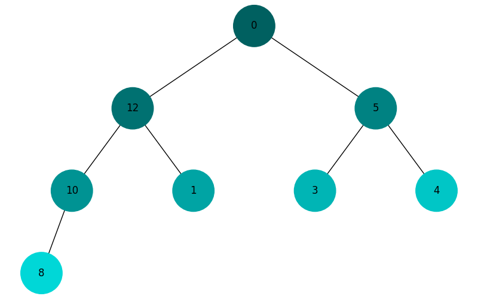

## Завдання 1.

Функції реалізовано.

### Приклад виводу виконання коду
Зв'язний список:
20
5
10
15
25

Зв'язний список після видалення вузла з даними 10:
20
5
15
25

Шукаємо елемент 15:
15

Розвернутий список: 
25
15
5
20

Відсортований список: 
5
15
20
25

Обєднання двох списків: 
1
5
15
16
19
20
25
25

## Завдання 2.

Візуалізація дерева Піфагора з використанням глибини 10:


## Завдання 3.

_Використано граф із ДЗ 6._

Опис графу: 
```python
{0: {1: 20, 3: 35}, 1: {2: 20}, 2: {4: 10}, 3: {4: 10}, 4: {5: 20, 10: 35, 7: 20}, 5: {6: 20, 8: 20}, 6: {9: 30}, 7: {12: 10}, 8: {13: 10}, 9: {11: 15}, 10: {6: 15}, 11: {12: 10}, 12: {13: 10}, 13: {14: 40}, 14: {}}
```
Час виконання вихідного алгоритму Дейсктри з ДЗ 6 (на основі черги): 4.679989069700241e-05 с

Відстані до всіх вершин від "0", алгоритм Дейсктри з ДЗ 6: 
```python 
{0: 0, 1: 20, 2: 40, 3: 35, 4: 45, 5: 65, 6: 85, 7: 65, 8: 85, 9: 115, 10: 80, 11: 130, 12: 75, 13: 85, 14: 125}
```
Час виконання алгоритму Дейсктри з використанням купи: 5.059991963207722e-05 с

Відстані до всіх вершин від "0", алгоритм Дейсктри з купою: 
```python 
{0: 0, 1: 20, 2: 40, 3: 35, 4: 45, 5: 65, 6: 85, 7: 65, 8: 85, 9: 115, 10: 80, 11: 130, 12: 75, 13: 85, 14: 125}
```

## Завдання 4.  

### Візуалізація бінарної купи


## Завдання 5.
Алгоритми візуалізації обходу дерева в глибину (DFS) та в ширину (BFS).

Кольори вузлів змінюються від темних до світлих відтінків залежно від порядку обходу.

### DFS


### BFS



## Завдання 6.

За умови, що бюджет 100 од., за допомогою жадібного алгоритму було визначено, що меню
матиме **870** калорій та має складатись з наступних елементів: 
* cola 
* potato
* pepsi
* hot-dog

У випадку застосування алгоритму алгоритмів динамічного програмування
(аналогічно до задачі про рюкзак), меню матиме **970** калорій та 
має складатись з наступних елементів: 
* pizza
* pepsi
* cola
* potato


## Завдання 7.

|   Сума | Аналітична імовірність   | Монте-Карло 100k      |   Різниця 100k, % | Монте-Карло 10М           |   Різниця 10М, % |
|-------:|:-------------------------|:----------------------|------------------:|:--------------------------|-----------------:|
|      2 | 2.78% (1/36)             | 2.80% (2796/100000)   |             0.016 | 2.78% (278389/10000000)   |          0.00389 |
|      3 | 5.56% (2/36)             | 5.59% (5587/100000)   |             0.027 | 5.56% (556262/10000000)   |          0.00262 |
|      4 | 8.33% (3/36)             | 8.30% (8300/100000)   |            -0.03  | 8.34% (833698/10000000)   |          0.00698 |
|      5 | 11.11% (4/36)            | 11.22% (11222/100000) |             0.112 | 11.11% (1111230/10000000) |          0.0023  |
|      6 | 13.89% (5/36)            | 13.84% (13837/100000) |            -0.053 | 13.88% (1387866/10000000) |         -0.01134 |
|      7 | 16.67% (6/36)            | 16.46% (16456/100000) |            -0.214 | 16.65% (1665271/10000000) |         -0.01729 |
|      8 | 13.89% (5/36)            | 13.92% (13920/100000) |             0.03  | 13.88% (1388418/10000000) |         -0.00582 |
|      9 | 11.11% (4/36)            | 11.18% (11178/100000) |             0.068 | 11.12% (1112114/10000000) |          0.01114 |
|     10 | 8.33% (3/36)             | 8.30% (8303/100000)   |            -0.027 | 8.33% (833199/10000000)   |          0.00199 |
|     11 | 5.56% (2/36)             | 5.59% (5586/100000)   |             0.026 | 5.56% (556074/10000000)   |          0.00074 |
|     12 | 2.78% (1/36)             | 2.81% (2815/100000)   |             0.035 | 2.77% (277479/10000000)   |         -0.00521 |


### Висновки:
Результати дослідження за допомогою методу Монте-Карло наближуються
до аналітично розрахованих значень з високою точністю за умови високої кількості 
випробувань.
